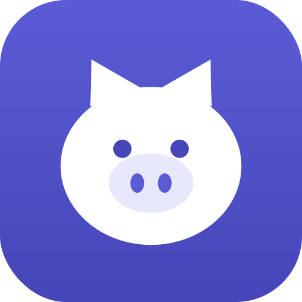

<div align="center">
  

  # Piggy Wallet

  **A simple offline-first expense tracker**

  [](https://nextjs.org/)
  [](https://react.dev/)
  [](https://tailwindcss.com/)
  [](https://firebase.google.com/)
  [](https://web.dev/progressive-web-apps/)

  [Live Demo](https://piggy-wallet-expense-tracker.vercel.app/) • [Report a Bug](https://github.com/fernandohalim/piggy-wallet/issues)
</div>

## What is Piggy Wallet?

**Piggy Wallet** is a lightweight, offline-first expense tracker that keeps working with or without a connection. Every expense is saved locally the instant you log it, and syncs to the cloud the moment you're back online. Sign in once and your data follows you across every device.

## Features

* **Offline-first by design:** log expenses with zero connectivity. Everything is stored locally in IndexedDB and queued for sync, so the app never blocks on the network.
* **Cross-device sync:** sign in with email or Google and your expenses, budgets, and settings sync through Firebase with a last-write-wins merge strategy.
* **Native-style entry:** on mobile, a custom numpad screen puts the amount front and center with a one-tap save — no fighting the OS keyboard.
* **Color-coded categories:** eight categories, each with its own icon and color, selectable from a clean dropdown.
* **Simple budgets:** set a monthly cap per category and track spend against it with a live progress meter.
* **Smart food budgeting:** set a daily food allowance (even, or weekday/weekend split) with day-to-day rollover plus weekly and full-cycle projections.
* **Custom budget cycle:** anchor your month to payday instead of the 1st — the setting syncs across devices.
* **Spending insights:** today and cycle totals, a category breakdown donut, and a 15-week spending heatmap on the home screen.
* **Logging streaks:** daily streak tracking with milestone badges to help the habit stick.
* **Responsive & installable:** a docked sidebar on desktop, a floating bottom bar on mobile, and full PWA install support on any device.

## Tech Stack

* **Framework:** [Next.js 16](https://nextjs.org/) (App Router)
* **Library:** [React 19](https://react.dev/)
* **Styling:** [TailwindCSS v4](https://tailwindcss.com/)
* **Auth & sync:** [Firebase](https://firebase.google.com/) (Authentication + Firestore)
* **Local storage:** [IndexedDB](https://developer.mozilla.org/en-US/docs/Web/API/IndexedDB_API) via [idb](https://github.com/jakearchibald/idb)
* **PWA / service worker:** [Serwist](https://serwist.pages.dev/)
* **Charts:** [Recharts](https://recharts.org/)

## Getting Started

To run this project locally, you'll need Node.js installed and a Firebase project (Authentication + Firestore enabled).

```bash
# clone the repository
git clone https://github.com/fernandohalim/piggy-wallet.git

# jump into the directory
cd piggy-wallet

# install the dependencies
npm install

# add your Firebase web config to .env.local
# NEXT_PUBLIC_FIREBASE_API_KEY=...
# NEXT_PUBLIC_FIREBASE_AUTH_DOMAIN=...
# NEXT_PUBLIC_FIREBASE_PROJECT_ID=...
# NEXT_PUBLIC_FIREBASE_STORAGE_BUCKET=...
# NEXT_PUBLIC_FIREBASE_MESSAGING_SENDER_ID=...
# NEXT_PUBLIC_FIREBASE_APP_ID=...

# start the local development server
npm run dev
```

Open [http://localhost:3000](http://localhost:3000) to see the app.

## License

This project is licensed under the MIT License - see the **LICENSE** file for details.